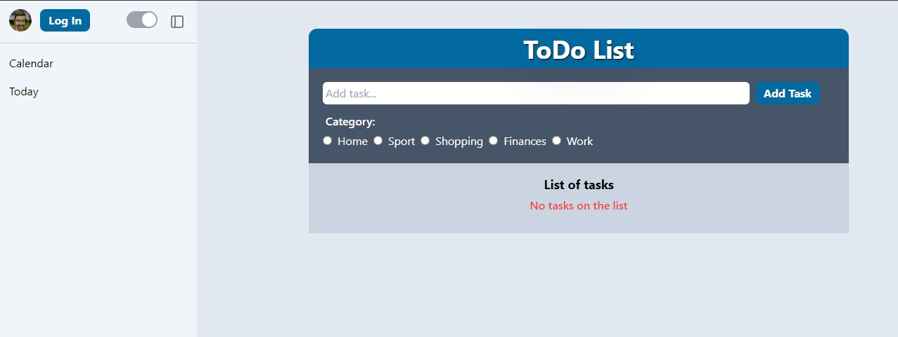

<h3 align="center">ToDoApp</h3>

  <p align="center">
    project_description
    <br />
    <a href="https://github.com/Astilion/ToDoApp"><strong>Explore the docs »</strong></a>
    <br />
    <br />
    <a href="https://github.com/Astilion/ToDoApp">View Demo (not implemented)</a>
  </p>
</div>


<!-- TABLE OF CONTENTS -->
<details>
  <summary>Table of Contents</summary>
  <ol>
    <li>
      <a href="#about-the-project">About The Project</a>
      <ul>
        <li><a href="#built-with">Built With</a></li>
      </ul>
    </li>
    <li>
      <a href="#getting-started">Getting Started</a>
      <ul>
        <li><a href="#prerequisites">Prerequisites</a></li>
        <li><a href="#installation">Installation</a></li>
      </ul>
    </li>
    <li><a href="#usage">Usage</a></li>
    <li><a href="#roadmap">Roadmap</a></li>
    <li><a href="#contact">Contact</a></li>
  </ol>
</details>


<!-- ABOUT THE PROJECT -->
## About The Project



This is my first project after completing the React course. It has a sandbox nature. 
In the project you can add, delete, modify tasks and mark them as completed. You can also set dark mode inside the navigation.

<p align="right">(<a href="#readme-top">back to top</a>)</p>


### Built With

* [![React][React.js]][React-url]
* [![Tailwind][tailwindcss.com]][Tailwind-url]
* [![Typescript][typescriptlang.org]][Typescript-url]

<p align="right">(<a href="#readme-top">back to top</a>)</p>


## Getting Started
To get a local copy up and running follow these simple example steps.

### Prerequisites

This is an example of how to list things you need to use the software and how to install them.
* npm
  ```sh
  npm install npm@latest -g
  ```

### Installation

1. Clone the repo
   ```sh
   git clone https://github.com/Astilion/ToDoApp.git
   ```
2. Install NPM packages
   ```sh
   npm install
   ```


<p align="right">(<a href="#readme-top">back to top</a>)</p>


<!-- USAGE EXAMPLES -->
## Usage
You can create a task list and modify it.

<p align="right">(<a href="#readme-top">back to top</a>)</p>


<!-- ROADMAP -->
## Roadmap

- [x] Adding, removing & modyfying tasks
- [ ] Signup & Login
    - [ ] Different ToDo for each user 
- [ ] Moving to React Native
- [ ] Live Demo


<p align="right">(<a href="#readme-top">back to top</a>)</p>


## Project Status
Project is: _in-progress_ 

<!-- CONTACT -->
## Contact

Mateusz Kamiński -  mkaminski.contact@gmail.com

Project Link: [https://github.com/Astilion/ToDoApp](https://github.com/Astilion/ToDoApp)

<p align="right">(<a href="#readme-top">back to top</a>)</p>


[React.js]: https://img.shields.io/badge/React-20232A?style=for-the-badge&logo=react&logoColor=61DAFB
[React-url]: https://reactjs.org/